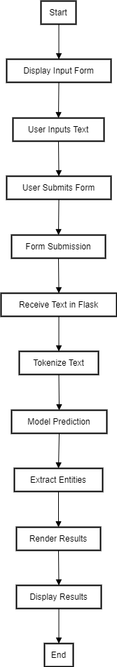

# Named Entity Recognition Web Application

## Overview

This project is a simple web application that performs Named Entity Recognition (NER) on input text using a pre-trained model from Hugging Face. The application is built using Flask for the backend and HTML/CSS for the frontend.

## Features

- Input text through a web interface
- Extract named entities using a pre-trained NER model
- Display the extracted entities on the web page

## Project-Flow
<div align="center">

</div>

## Technologies Used

- Python
- Flask
- Hugging Face Transformers
- HTML/CSS

## Setup and Installation

### Prerequisites

- Python 3.9+
- pip

### Installing Dependencies

1. Clone the repository:

```bash
git clone https://github.com/yourusername/ner_flask_app.git
cd ner_flask_app
   python app.py
   ```

